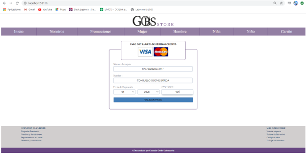
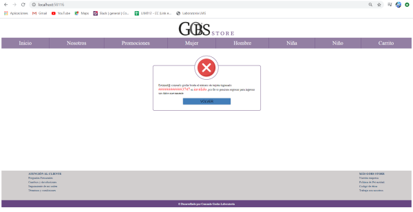
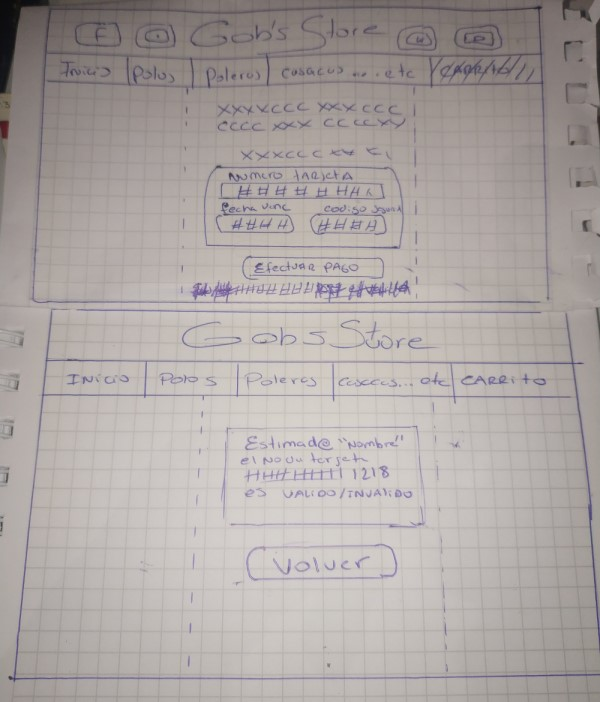
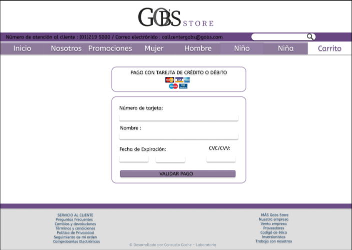
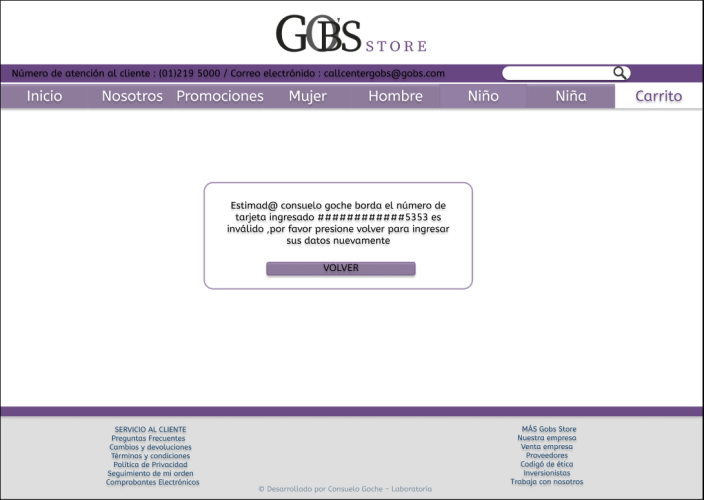

# Proyecto Gobs Store

## Índice

* [1. Introducción](#1-introducción)
* [2.Funcionamiento de la aplicación](#2-funcionamiento-de-la-aplicación)
* [3. Resumen de la aplicación](#3-resumen-de-la-aplicación)
* [4. Imagen final del proyecto](#4-imagen-final-del-proyecto)
* [5. Investigación UX](#5-investigación-UX)

## 1. Introducción

El presente proyecto abarca el uso del `algoritmo de Luhn`, también llamado algoritmo
de módulo 10, para la validación del número de tarjeta de crédito o débito.
En este proyecto usaremos el algoritmo para verificar la tarjeta de crédito o débito
ingresada para la cancelación de pedidos en la plataforma web de `Gobs Store` (empresa
de venta y distribución de prendas de vestir).
La plataforma será capaz de verificar si la tarjeta ingresada es válida o inválida, 
mostrándonos un mensaje que enmascara los dígitos de esta tarjeta con un “#”, excepto
los ultimos 4 digitos. 

## 2. Funcionamiento de la aplicación

* El usuario debe colocar el número de tarjeta, nombre, fecha de expiración y CVV/CVC.
* El usuario debe dar `Click` en el botón `VALIDAR PAGO`.
* EL sistema verificará que no ingrese un campo vacio.
* EL sistema realizará la verificación del número de tarjeta ingresado haciendo uso del
  algoritmo implementado.
* El sistema mostrará el número de tarjeta enmascarado, cada dígito por un `"#"` a escepción 
  de los 4 ultimos. Ejemplo `"############1218"`.
* El sistema mostrará `"Válido"` en color `"Verde"` si este número es válido.
* El sistema mostrará `"Inválido"` en color `"Rojo"` si este número es inválido.
* En esta interface tambien se mostrara un botón `"VOLVER"` que te devolvera a la interface de 
  ingreso de datos.
  
## 3. Resumen de la aplicación
  
* Esta aplicación esta contenida en mi cuenta de [git hub](https://github.com/consuelogoche-1994/LIM013-card-validation).
* La planificación del proyecto de realizó en la plataforma de trello [Proyecto Gobs Store](https://trello.com/b/gNUMWMDu/gobs-store).
* El prototipo fue realizado en figma [Prototipo Gobs Store](https://www.figma.com/proto/JpfP9IlzTf2RXUImIdh2NP/Gobs-Store?node-id=1%3A4&scaling=min-zoom).

## 4. Imagen final del proyecto

* Interface de validación

* Interface de resultados

## 5. Investigación UX

### Identificación del problema

  Gobs Store es una iniciativa de venta y distribución de prendas de calidad a un precio justo,
  normalmente sus ventas se realizan por medio de una página de facebook, donde los compradores 
  se ponen en contacto con el vendedor para preguntar precios y promociones, esto es muy demandante 
  para el vendedor, tiene que atender a muchos clientes y algunos de ellos no compran los productos, 
  tan solo quieren información. También es importante mencionar que debido a la cantidad de personas
  que se ponen en contacto con el vendedor se hace difícil contestar de forma inmediata y esto genera
   pérdida en ventas y descontento por parte de los clientes.

  Los pagos de las compras se realizan a contra entrega y en muy pocas ocasiones mediante depósitos
  a la cuenta del banco del dueño de la empresa, esto sin duda genera mucha perdida de dinero a causa
  de las personas que no asisten a las citas para la entrega de sus productos y un mal seguimiento de
  las ganancias, así como también descontento por parte de los clientes que tienen que estar yendo a 
  su banco a retirar los montos.

  Gobs Store tiene previsto crecer en ventas y en oferta de productos, pero sabe que solo manejarlo 
  mediante una página de facebook no es suficiente para sus propósitos.

### Usuario final

  Este aplicativo está dirigido a todas aquella personas que deseen adquirir prendas de alta calidad
  a un precio acorde a lo adquirido, sin la necesidad de salir de casa y cancelarlo con un medio de
  pago sencillo y seguro.

### Objetivo en relación al producto

  EL objetivo es facilitar y hacer la experiencia de compra mas amena para los clientes, poniendo a
  disposición toda la información de los productos y brindandole un método de pago seguro y facil de 
  ejecutar.

  Todo lo mencionado estará contenido en la pagina Web a desarrollar.

### Solución problemas/necesidades

  Con el paso del tiempo la tecnología se ha vuelto indispensable para muchos ámbitos de la vida, 
  simplifica procesos, reduce tiempos entre otros beneficios. Lo que Gobs Store necesita para solucionar
  la problemática expuesta es la creación e implementación de una página web que sea capaz de mostrar 
  información de los productos y recibir pagos con tarjeta de credito o debito.
 
  Para poder verificar la validez de la tarjeta se usa el algoritmo de Luhn, también llamado algoritmo
  de módulo 10, este algoritmo nos permitirá validar la tarjeta para proceder con el cobro del importe 
  de los productos.

### Primer prototipo de papel

### Feedback recibido

  * Enfocarse más en la interface que mostrará los resultados de la validación.
  * Mejorar el tamaño de letra donde se muestra los resultados.
  * hacer los botones mas vistosos para los clientes.
  * Cambiar el color de letra de acuerdo al resultado obtenido Válido o Inválido.
  * Investigar más de los test unitarios.

### Imagen de prototipo final

  * Primera interface

   

  * Segunda Interface

  

